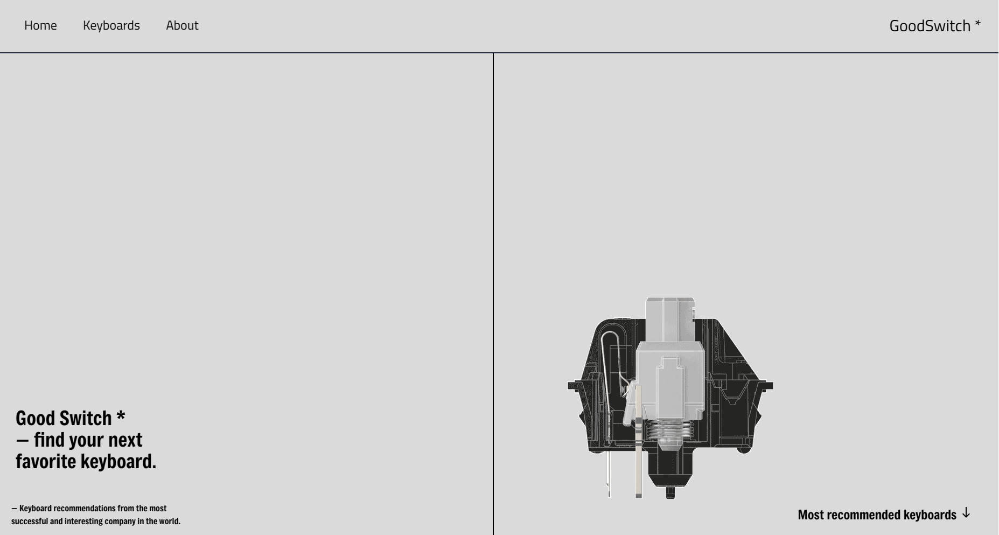
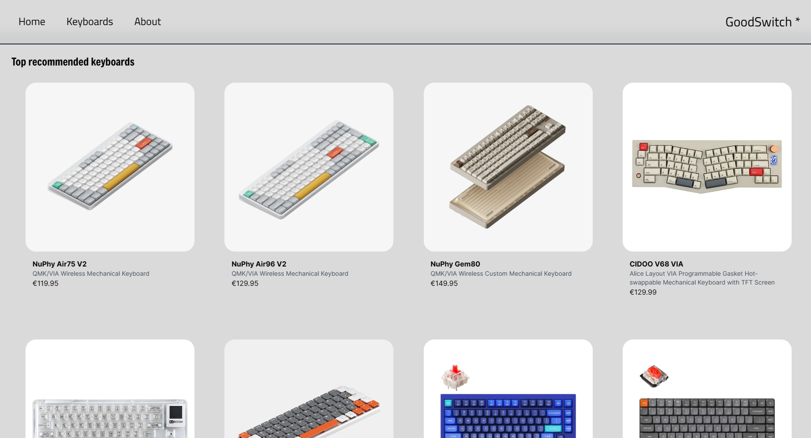
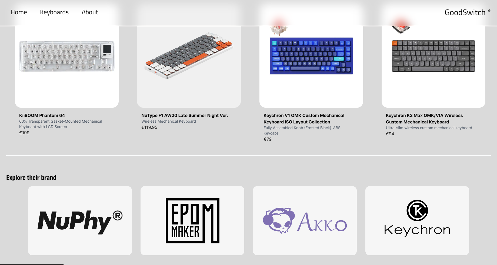
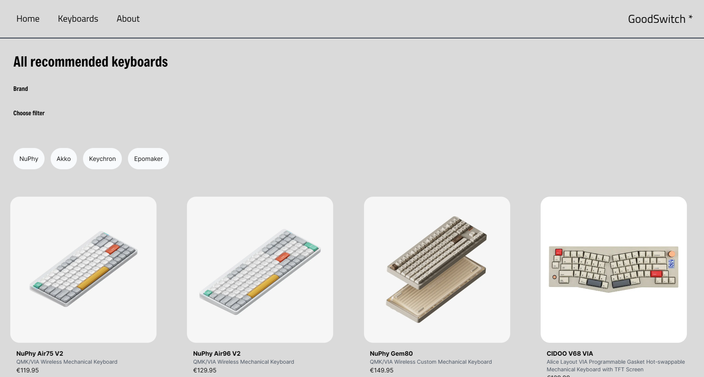
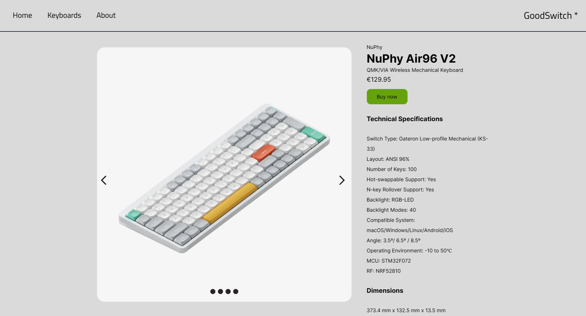

<div align="center">

<a target="_blank" href="https://github.com/tungphan2823/good-keyboards" >
    
    
    
    
    
</a>

[](https://tungphan.id.vn/)
[]()
[](https://vercel.com/home?utm_source=nuro&utm_campaign=oss)

</div>

## 🛠 Development

Clone the repository

```zsh
git clone https://github.com/tungphan2823/good-keyboards
```

Install dependencies

```zsh
npm install

# Or using Yarn

yarn
```

Start the development server

```zsh
npm run dev

```
